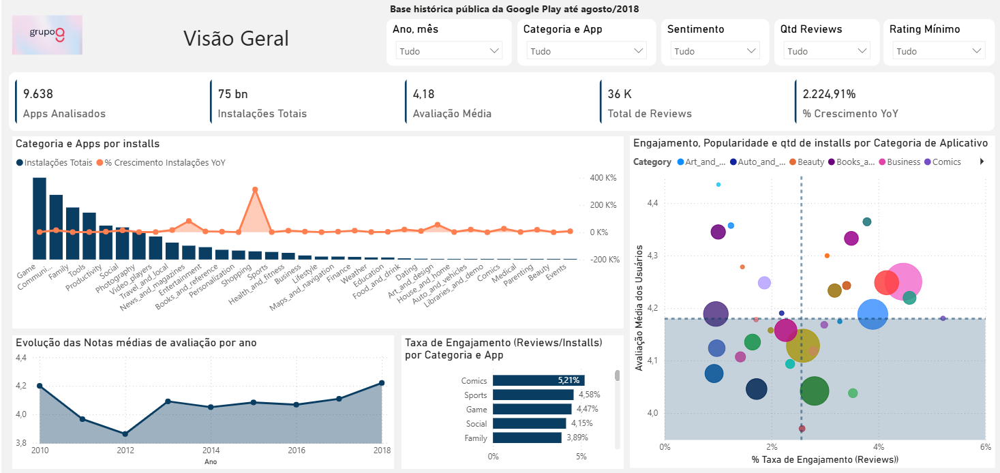
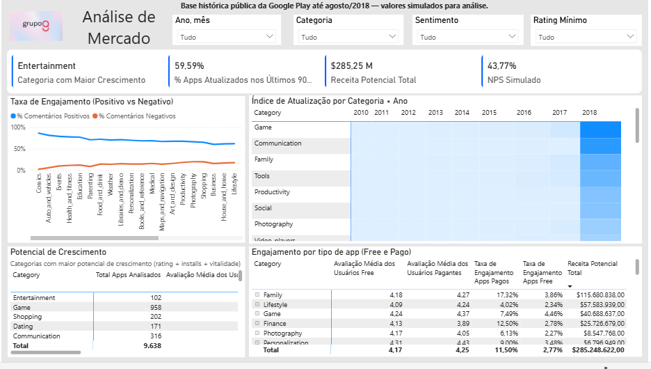
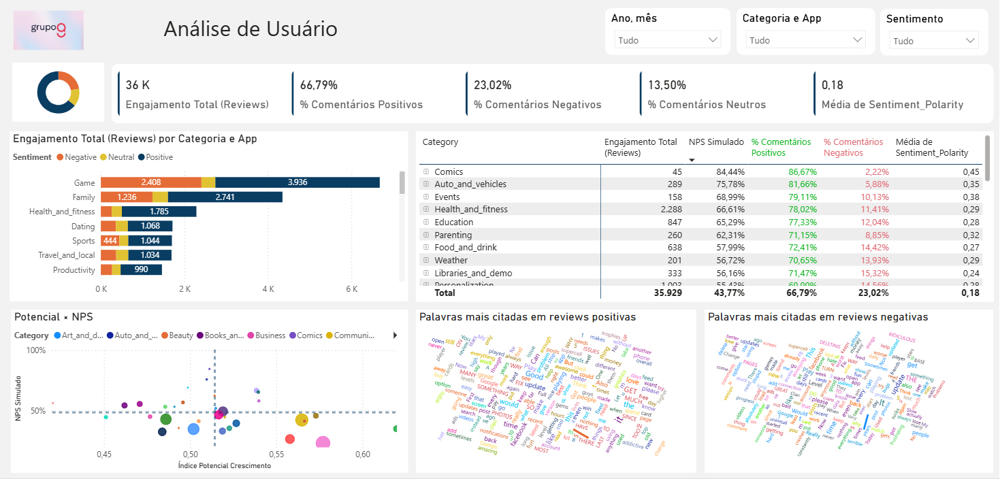

# Projeto de Análise de Aplicativos 

**Candidato:** Victor Flausino  
**Data:** Outubro/2025  

## Contexto do Desafio

Este projeto foi desenvolvido com base em dados públicos do Google Play Store (até agosto/2018).

Para garantir a qualidade e a confiabilidade da análise, os dados brutos (googleplaystore.csv e googleplaystore_user_reviews.csv) passaram por um processo de ETL, documentado no arquivo 🔗[Notebook colab](Notebook_google_colab.ipynb). 

### Ferramentas Utilizadas:

Google Colab (Python/Pandas): Para exploração inicial, limpeza e transformação dos dados.

DuckDB: Para aplicar transformações SQL em Python.

Power BI: Para a construção do dashboard interativo e visualização dos insights..

---

## Preparação e Modelagem dos Dados

### Bases utilizadas
 ### 🔗[Base apps](googleplaystore.csv) — dados dos aplicativos (instalações, preço, categoria, rating etc.)
 
| **Campo** | **Decisão Tomada** |
|------------|--------------------|
|  **Category** | Padronização para Title Case |
|  **Rating_Imputed** | Imputação de valores nulos com média da categoria |
|  **Reviews** | Conversão para tipo numérico |
|  **Installs** | Limpeza e padronização de formato |
|  **Price** | Conversão monetária para `DOUBLE` |
|  **Last_Updated** | Conversão para formato `DATE` |
|  **Reach_Band** | Criação de faixas por volume de instalações |
|  **Revenue_Potential** | Cálculo de potencial de receita (`Installs * Price`) |
 
 ### 🔗[Base Reviews](googleplaystore_user_reviews.csv) — avaliações e sentimentos de usuários.

| **Campo** | **Decisão Tomada** |
|------------|--------------------|
|  **Sentiment** | Padronização para Title Case *(Positive, Negative, Neutral)* |
|  **Sentiment_Polarity / Sentiment_Subjectivity** | Arredondamento para 2 casas decimais |
|  **Filtro Geral** | Exclusão de registros sem texto (`Translated_Review IS NOT NULL`) |

### Transformações aplicadas (ETL)

- **Padronização textual:** correção de capitalização (`Category`, `App`) e remoção de espaços com `TRIM()`. 
- **Imputação de nulos:** `Rating` com valor “NaN” substituído pela **média da categoria**. 
- **Correção de tipos:** Conversão de campos numéricos e remoção de símbolos especiais (+, ,, $)
- **Padronização do campo Sentiment** (Positive, Neutral, Negative)
- **Datas:** conversão do campo `"Last Updated"` para data e criação da coluna `Ano_Atualizacao`.  
- **Novas métricas criadas:**
  - `Reach_Band` (baixo / médio / alto) — faixa de instalações.  
  - `Revenue_Potential` — potencial de receita (`Installs * Price` para apps pagos).  

  **Notebook ETL**
  
  🔗[ETL](Notebook_google_colab.ipynb)
  
  🔗 

### Exportação de Dados
- As tabelas finais foram exportadas do Google Colab para formato CSV compatível:
- (Bases_tratadas/apps_tratados.csv)
- (Bases_tratadas/reviews_tratados.csv)
 
- Estes arquivos alimentaram o modelo de dados no Power BI.
 
 🔗 [Acessar Dashboard no Power BI](https://app.powerbi.com/view?r=eyJrIjoiODljODBlYzItZmIzZi00OWI0LWFiMmYtYTM5Mjc4NmM5MDU5IiwidCI6IjZiZjI3ZWMxLTRkOWItNGFlNC1iMGYxLTNhNDU1NmI1YWE0ZCJ9)

---

## Estrutura do Dashboard

O painel foi construído no **Power BI** e dividido em **três páginas principais.**

**Análises Multinível (Categoria → Aplicativos)**

Em diversos visuais, especialmente:

Nos visuais(gráficos) principais — Categoria e Apps por Installs, Taxa de Engajamento (Reviews/Installs) e Engajamento Total (Reviews) por Categoria e App — foi habilitada a função de “Desagregar Hierarquia” **(Drill Down)**.
Esse recurso permite navegar entre níveis de detalhe.(ex:Category -> Apps).

---

### 🟦 Página 1 – Visão Geral
**Objetivo:** apresentar uma visão macro do mercado de aplicativos.

**Principais indicadores:**
- Total de Apps  
- Instalações Totais  
- Rating Médio  
- Total de Reviews  
- NPS Estimado  

**Principais análises:**
- Evolução temporal das notas médias  
- Correlação entre engajamento e popularidade  
- Taxa de engajamento (reviews / installs)

- 📸 **1°Página:**
 

---

### 🟩 Página 2 – Análise de Mercado e Crescimento
**Objetivo:** identificar categorias com **maior potencial de investimento**.

**KPIs:**
- Categoria com Maior Crescimento  
- % de Apps Atualizados recentemente (em relação a 2018)  
- Receita Potencial Total  
- Índice de Potencial de Crescimento  

**Cálculo do Índice de Potencial:**

- Índice = 0.4 * %Rating + 0.4 * %Installs + 0.2 * %Atualização

**Principais insights:**
- **Entertainment** lidera em potencial de crescimento.  
- **Education** tem excelente aceitação, mas baixo engajamento — alta oportunidade.  
- **Games** possui grande volume, porém saturação de mercado.  

- 📸 **2°Página:**
 

---

### 🟨 Página 3 – Voz do Usuário
**Objetivo:** compreender a percepção dos usuários e os sentimentos expressos nas avaliações.

**KPIs:**
- Engajamento Total (Reviews)  
- % de Comentários Positivos, Negativos e Neutros  
- Média de Polaridade  

**Análises complementares:**
- Nuvens de palavras para comentários positivos e negativos  
- Correlação entre NPS e Potencial de Crescimento  
- Tabela de Sentimentos por Categoria  

- 📸 **3°Página:**

---

## Decisões Tomadas

| Tema | Decisão |
|------|----------|
| Imputação de Rating | Substituir nulos pela média da categoria.
| Normalização de Métricas | Escalar variáveis (0–1).
| Engajamento | Usar Reviews/Installs.
| Corte temporal | Analisar até 2018.
| Ajustes nas escalas | %Rating, %Installs, %Atualização
| Aplicação de pesos | Índice = 0.4 * %Rating + 0.4 * %Installs + 0.2 * %Atualização

---

## Conclusões

- **Entertainment**: alta aceitação e crescimento consistente.  
- **Education**: alto rating e oportunidade de expansão via engajamento.  
- **Games**: popularidade alta, mas indícios de saturação.  
- **Social e Tools**: atualização frequente correlaciona com melhor percepção dos usuários. 

> Categorias que combinam **boa avaliação**, **alta atualização** e **engajamento crescente** representam as melhores oportunidades de investimento.

## Estrutura do Projeto

/projeto-analise-de-apps

-  **Notebook ETL**
  
🔗[ETL](Notebook_google_colab.ipynb)

-  **Dados Tratados**
  
  🔗[Basese tratadas_Apps](Bases_tratadas/apps_tratados.csv)

  🔗[Basese tratadas_Reviews](Bases_tratadas/reviews_tratados.csv)

-  **Dashboard**
  
🔗[Anális de Mercado](Teste Grupo Q.pbix)

🔗 [Acessar Dashboard no Power BI](https://app.powerbi.com/view?r=eyJrIjoiODljODBlYzItZmIzZi00OWI0LWFiMmYtYTM5Mjc4NmM5MDU5IiwidCI6IjZiZjI3ZWMxLTRkOWItNGFlNC1iMGYxLTNhNDU1NmI1YWE0ZCJ9)

---
### Pergunta: Você utilizou IA para alguma parte do teste ? 

Sim, utilizei ferramentas de IA Generativa,como um acelerador de produtividade,
A IA foi crucial para transformar a análise técnica em uma comunicação de alto impacto.

## Contato
📧 *victorflausino009@gmail.com*  
🔗 [LinkedIn - Victor Flausino](https://www.linkedin.com/in/victor-flausino-705b151b4/)
 

---
