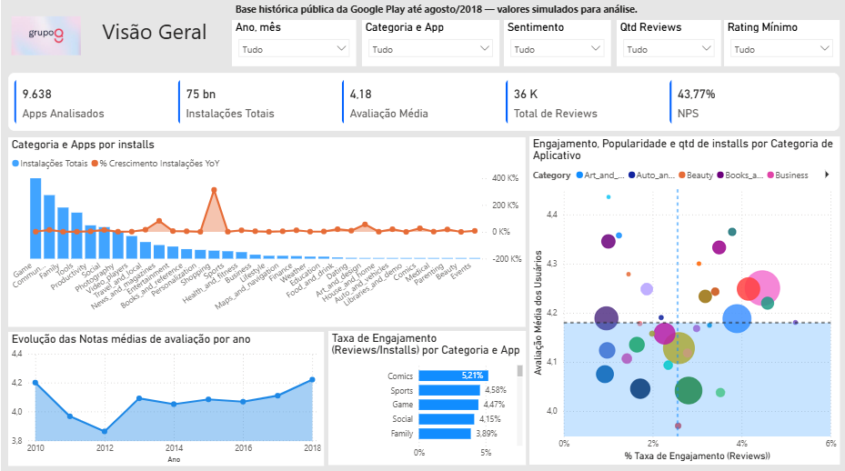
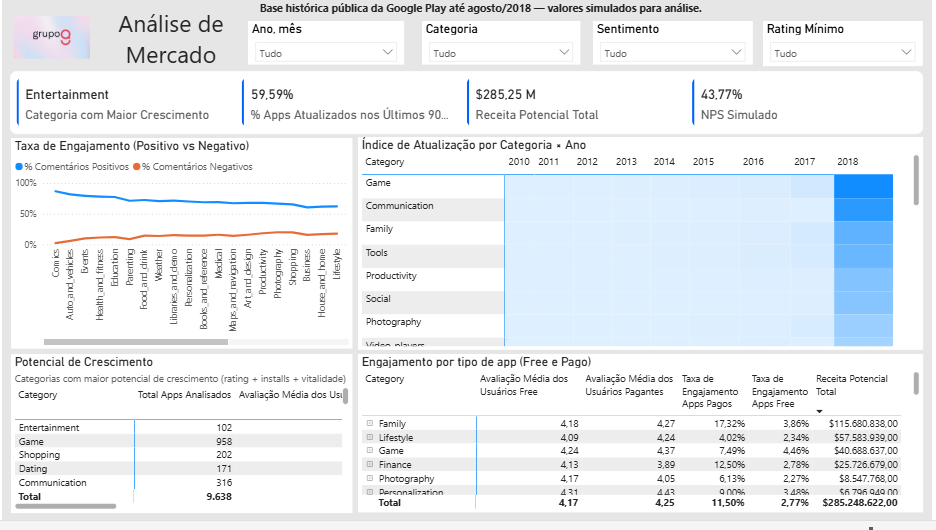
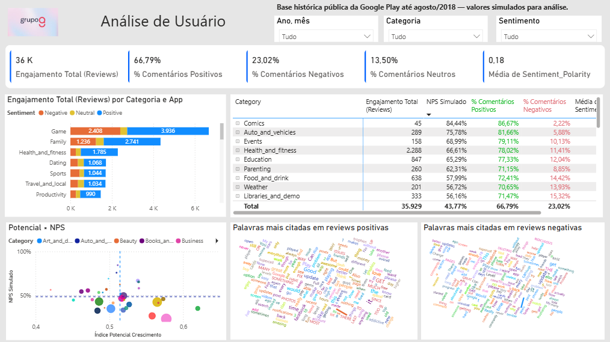

# 📊 Projeto de Análise de Aplicativos - Grupo Q

**Autor:** Victor Flausino  
**Data:** Outubro/2025  

** 🧰  Tecnologias Utilizadas
- **Python (Google Colab)** – para limpeza e tratamento com DuckDB  
- **DuckDB SQL Engine** – processamento de grandes CSVs com alta performance  
- **Power BI** – visualização, modelagem e storytelling de dados  
- **Markdown + GitHub** – documentação e publicação do projeto  

---

## 🧠 1. Contexto do Desafio

Este projeto foi desenvolvido com base em dados públicos do Google Play Store (até agosto/2018), com o objetivo de apoiar a diretoria de uma empresa de **aplicativos educacionais** a entender:

- Quais categorias têm **maior potencial de crescimento**  
- Como está a **percepção dos usuários**  
- Quais fatores influenciam a **aceitação e o engajamento** dos apps  

O trabalho incluiu todo o ciclo de dados: **extração, tratamento, modelagem e análise visual**, com aplicação de técnicas analíticas para gerar **insights de negócio**.

---

## ⚙️ 2. Preparação e Modelagem dos Dados

### Bases utilizadas
- `googleplaystore.csv` — dados dos aplicativos (instalações, preço, categoria, rating etc.)  
- `googleplaystore_user_reviews.csv` — avaliações e sentimentos de usuários.  

### Transformações aplicadas (ETL em DuckDB via Google Colab)
- **Padronização textual:** correção de capitalização (`Category`, `App`) e remoção de espaços com `TRIM()`.  
- **Correção de tipos:** conversão de campos numéricos e remoção de símbolos (“+”, “,”, “$”).  
- **Imputação de nulos:** `Rating` com valor “NaN” substituído pela **média da categoria**.  
- **Datas:** conversão do campo `"Last Updated"` para data e criação da coluna `Ano_Atualizacao`.  
- **Novas métricas criadas:**
  - `Reach_Band` (baixo / médio / alto) — faixa de instalações.  
  - `Revenue_Potential` — potencial de receita (`Installs * Price` para apps pagos).  

---

## 📊 3. Estrutura do Dashboard

O painel foi construído no **Power BI** e dividido em **três páginas principais**, cada uma com propósito claro de storytelling.

---

### 🟦 Página 1 – Visão Geral
**Objetivo:** apresentar uma visão macro do mercado de aplicativos.

**Principais indicadores:**
- Total de Apps  
- Instalações Totais  
- Rating Médio  
- Total de Reviews  
- NPS Estimado  

**Principais análises:**
- Evolução temporal das notas médias  
- Correlação entre engajamento e popularidade  
- Taxa de engajamento (reviews / installs)

- 📸 **1°Página:**

---

### 🟩 Página 2 – Análise de Mercado e Crescimento
**Objetivo:** identificar categorias com **maior potencial de investimento**.

**KPIs:**
- Categoria com Maior Crescimento  
- % de Apps Atualizados recentemente (em relação a 2018)  
- Receita Potencial Total  
- Índice de Potencial de Crescimento  

**Cálculo do Índice de Potencial:**

- Índice = 0.4 * %Rating + 0.4 * %Installs + 0.2 * %Atualização

**Principais insights:**
- **Entertainment** lidera em potencial de crescimento.  
- **Education** tem excelente aceitação, mas baixo engajamento — alta oportunidade.  
- **Games** possui grande volume, porém saturação de mercado.  

- 📸 **2°Página:**
)

---

### 🟨 Página 3 – Voz do Usuário
**Objetivo:** compreender a percepção dos usuários e os sentimentos expressos nas avaliações.

**KPIs:**
- Engajamento Total (Reviews)  
- % de Comentários Positivos, Negativos e Neutros  
- Média de Polaridade  

**Análises complementares:**
- Nuvens de palavras para comentários positivos e negativos  
- Correlação entre NPS e Potencial de Crescimento  
- Tabela de Sentimentos por Categoria  

- 📸 **3°Página:**
)

---

## 💡 4. Decisões Analíticas Tomadas

| Tema | Decisão | Justificativa |
|------|----------|----------------|
| Imputação de Rating | Substituir nulos pela média da categoria | Evita perda de dados e mantém coerência estatística. |
| Normalização de Métricas | Escalar variáveis (0–1) | Permite comparação justa entre variáveis distintas. |
| Filtro de Significância | Excluir apps com < 50 reviews | Reduz distorções causadas por amostras pequenas. |
| Engajamento | Usar Reviews/Installs | Mede vitalidade e interesse do usuário. |
| Corte temporal | Analisar até 2018 | Mantém coerência com o último ano da base. |

---

## 🧩 5. Conclusões e Recomendações

- **Entertainment**: alta aceitação e crescimento consistente — manter investimentos.  
- **Education**: alto rating e oportunidade de expansão via engajamento.  
- **Games**: popularidade alta, mas indícios de saturação.  
- **Social e Tools**: atualização frequente correlaciona com melhor percepção dos usuários.  

🎯 **Conclusão executiva:**
> Categorias que combinam **boa avaliação**, **alta atualização** e **engajamento crescente** representam as melhores oportunidades de investimento.

---

## 📁 6. Estrutura do Projeto

/projeto-analise-de-apps

- 💻 **Notebook ETL**

- 🎯 **Dados Tratados**

                    (reviews_tratados.csv.csv)
- 📊 **Dashboard**

🔗 [Link Dashboard]([[[https://www.linkedin.com/in/victor-flausino](https://www.linkedin.com/in/victor-flausino-705b151b4/)](https://app.powerbi.com/view?r=eyJrIjoiODljODBlYzItZmIzZi00OWI0LWFiMmYtYTM5Mjc4NmM5MDU5IiwidCI6IjZiZjI3ZWMxLTRkOWItNGFlNC1iMGYxLTNhNDU1NmI1YWE0ZCJ9)](https://app.powerbi.com/view?r=eyJrIjoiODljODBlYzItZmIzZi00OWI0LWFiMmYtYTM5Mjc4NmM5MDU5IiwidCI6IjZiZjI3ZWMxLTRkOWItNGFlNC1iMGYxLTNhNDU1NmI1YWE0ZCJ9))

---

## 📬 Contato
📧 *victorflausino009@gmail.com*  
🔗 [LinkedIn - Victor Flausino]([[https://www.linkedin.com/in/victor-flausino](https://www.linkedin.com/in/victor-flausino-705b151b4/)](https://www.linkedin.com/in/victor-flausino-705b151b4/))  

---
